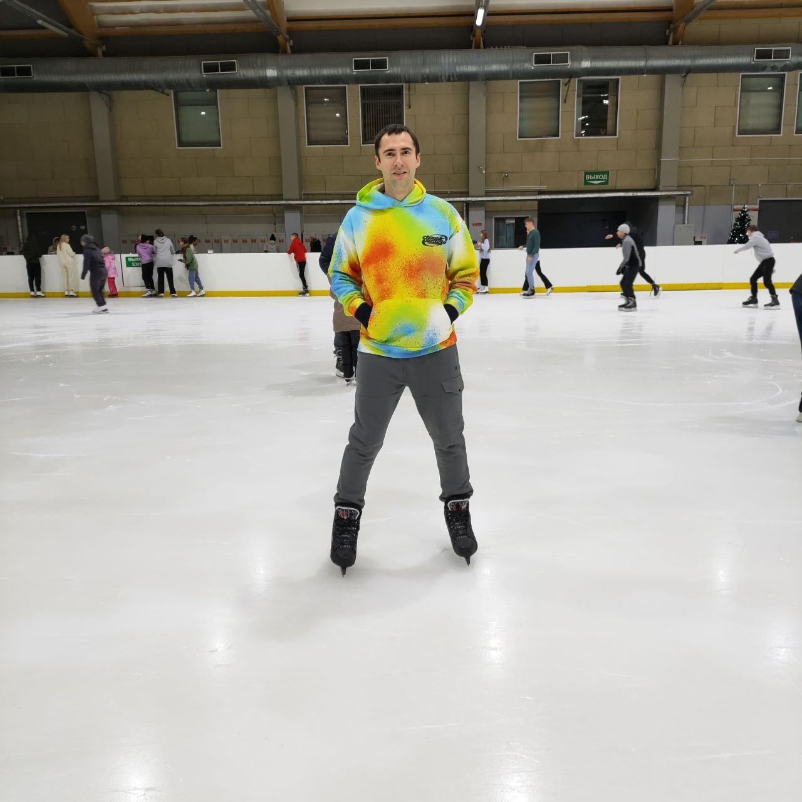

***

***
# Vladimir Burautsou
***
## *Junior Frontend Developer*
***
## Contact information:
* **Location:** *Minsk, Belarus*
* **Phone:** *+375447440150*
* **Email:** *vovchikbura@mail.ru*
* **GitHub:** *[VladimirSpider](https://github.com/VladimirSpider)*
* **LinkedIn:** *[Vladimir Burautsou](https://www.linkedin.com/in/vladimir-burautsou-54560920b/)*

***
### About myself:

Hello. My name is Vladimir. I am 29 years old. I have two higher educations.
Firs - Energy Engineer(Belarusian National Technical University). Second - web-designer programmer(Belarusian State University of Information Technologies).
Then I took courses in python programming and HTML, CSS. I am currently working as Junior Frontend Developer.

#### My personal qualities

* Responsible
* Hardworking
* Purposeful
* Persistent
* Team player
* Leader

***
### Skills:
* HTML5, CSS3
* JavaScript
* TypeScript
* React
* Python
* Adobe Photoshop
* 3ds Max

***
### Code Example:
```
function divisors(integer) {
    let divisorsArray = [];
    for (let i = 2; i < integer; i++) {
        integer % i == 0 && divisorsArray.push(i); 
    }
    return divisorsArray.length == 0 ? `${integer} is prime`: divisorsArray;
};
``` 
***
### Languages:
* Russian - native
* English - pre-intermediate (A2+)

***


